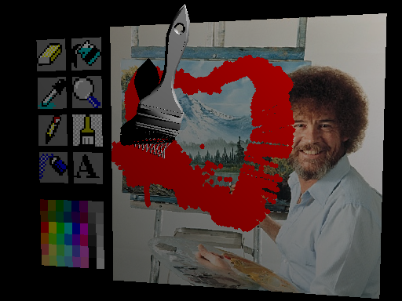
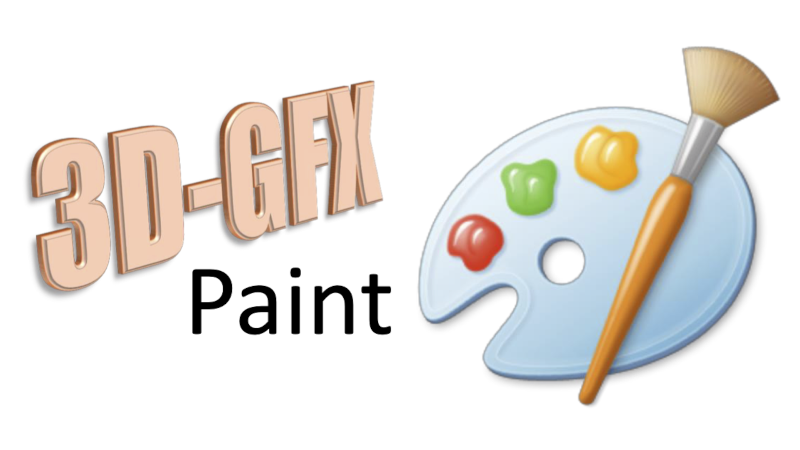

# 3D-GFX Paint - CS488 Project - Amin Mojtahed



### Demo Video
[[YouTube]](https://youtu.be/H4EavYZ-vhA)

Recorded by compiling once and executing with different files.

Intermediate task GIFs are also available.

## Description

3D-GFX Paint is a 3D graphical adaptation of classic MS Paint software, with twists to turn it into an interactive painting simulator environment.

This program uses a hybrid processing system (rasterization for rendering and ray tracing for shading and collision) and utilizes particle, rigid, and deformable structures for physics-based simulation. It is interactive, allowing the user to control a 3D painting tool object, collide it with a canvas object, and manipulate the canvas texture. It also supports 3D navigation of the painting environment and loading custom object models. The painting tools are designed with unique features and properties so that their collisions produce distinct visual effects.

## Compilation

> NOTE: This repository does not include the `cs488.h` header file. But you can still run the executable by
```bash
mv project-media media
cd build
./3D-GFX_Paint
# OR
./3D-GFX_Paint ../media/project-media/<INPUT_OBJ_FILE>.obj
```
> If you have obtained a fully implemented `cs488.h` file, you can compile the project by
```bash
mv main.cpp cs488.h project.h src
mv project-media media
cd build
cmake ../CMakeLists.txt
make
```

Compile and run after moving and replacing the code files (`main.cpp`, `cs488.h`, and `project.h`) into the `src` directory, and moving the `project-media` folder under the `media` directory within the default workspace setup.

Run without any arguments to load a blank square canvas.

Pass a file path as an optional argument to use a custom model as your canvas instead. E.g.:
```bash
./3D-GFX_Paint ../media/project-media/mecha_guy_edited.obj
```

**IMPORTANT: Interactions work best with a mouse, though a trackpad is usable.**

### File tree to compile:
```
Project/
├── src/
│   ├── main.cpp
│   ├── cs488.h
│   ├── project.h
│   └── …
├── media/
│   ├── project-media/
│   └── …
└── …
```

### Application Control Mapping

| Category | Input / Key | Action & Description |
| :--- | :--- | :--- |
| **Mouse Controls** | Move Mouse | Rotate tool anchor around view origin (slight Z-depth adjustment) |
| | Scroll Wheel / Trackpad | Adjust tool anchor distance from camera (major Z-depth adjustment) |
| | Left-Click | Select tool when tip overlaps a toolbar tile |
| | Right-Click (Hold) + Move | Freeze tool anchor and rotate tool tip around it |
| **Tool Selection** | `1` – `8` | Direct tool selection:<br>`1`: Eraser \| `2`: Bucket \| `3`: Ink/Eyedropper \| `4`: Magnifier<br>`5`: Pencil \| `6`: Brush \| `7`: Airspray \| `8`: Text |
| | Collision Interaction | Physical collision with toolbar tiles switches tools; collision with color palette picks active color |
| **Environment & Physics** | `-` / `+` | Decrease / increase gravity along -Z dimension by 50.0f |
| | `[` / `]` | Decrease / increase spring (`BendBody`) stiffness |
| | `SHIFT` (Hold) | 10x multiplier for WASDQZ camera movement, gravity, and stiffness adjustments |
| **System Toggles** | `C` | Cycle collision modes:<br>1. All tool vertices & faces *(default)*<br>2. Virtual particles only (anchor, tip, hair/spray)<br>3. Mouse coordinate raycast (tool hidden) |
| | `B` | Cycle optimization modes:<br>1. All optimizations enabled *(default)*<br>2. Disable collision & particle optimization<br>3. Disable ray tracing optimization as well<br>4. Complete brute-force (no optimizations) |
| | `N` | Cycle Non-Photorealistic Rendering (NPR) modes:<br>1. Smooth / Off *(default)* \| 2. 4 discrete tones<br>3. 8 discrete tones \| 4. 16 discrete tones |
| | `/` | Show / hide debug particles |
| **Legacy Render Controls** | `V` | Toggle vertex rendering (off by default) |
| | `L` | Toggle lighting and shadow rendering |
| | `R` | Switch main rendering between rasterization and ray tracing |
| | `P` | Toggle ray tracing progress display |

## Specification

Objective Results:
- **1) UI & Tool Interaction:** Handled by loading a custom MS Paint-style toolbar UI textured onto meshes. The mouse raycasts into the scene to select tools, allowing full 3D interaction.
- **2) Rigid Bodies:** Built the `RigidBody` structure using Verlet-integrated particles for the anchor and tip. The mesh translates and dynamically rotates using custom axis-angle math based on the vector between these particles.
- **3) Deformable Bodies:** Built the `BendBody`, extending `RigidBody` to apply spring forces proportional to the stiffness constant (`globalSpringStiffness`) and inverse `deltaT`, straightening dynamically simulating hair segments.
- **4) Mesh Collisions:** A `resolveParticleMeshCollision` function traces a ray from a particle's previous position to its current, determining penetration with canvas and UI elements, shifting particles via a small `skinOffset` along the collision normal.
- **5) Friction:** Inside the collision resolution function, incoming velocities are decomposed. Tangential velocity drops depending on static ($\mu_s = 0.6$) and kinetic ($\mu_k = 0.4$) friction constraints, preventing indefinite sliding.
- **6) Texture Painting:** During a valid collision, world-space hit points are mapped to 2D `UV` coordinates. The pixels in the mesh's material texture array are modified based on the `currentColor` state to reflect the painting effect.
- **7) BVH Optimizations:** A customized BVH was built with frustum culling during rasterization, early traversal exiting in raytracing, and a dynamic `refitBVH` function for rigid bodies (updating AABBs without rebuilding the tree).
- **8) Non-Photorealistic Rendering:** Modified the `shade()` function in `cs488.h`. It quantizes the Lambertian diffuse lighting dot product into user-adjustable discrete bands (4, 8, or 16) for a cel-shaded appearance.

### Extra Performance Report

**Performance Comparison Across Optimization Modes**

| Test Setup (Canvas & Tool) | Mode 0 (Full) | Mode 1 (-Coll/Part) | Mode 2 (-RT) | Mode 3 (None) | Key Performance Takeaway |
| :--- | :---: | :---: | :---: | :---: | :--- |
| **Default Canvas (2 tris)**<br>Pencil tool (no interaction) | 6 FPS<br>(166 ms) | 6 FPS<br>(154 ms) | 1 FPS<br>(850 ms) | 1 FPS<br>(835 ms) | **4.5x improvement** via Ray Tracing optimization |
| **Mecha Guy (~450 tris)**<br>Pencil tool (no interaction) | 8 FPS<br>(120 ms) | 4 FPS<br>(210 ms) | 1 FPS<br>(890 ms) | 1 FPS<br>(800 ms) | **4.5x improvement** via RT opt; **~2x** via Collision/Particle opt |
| **Airspray Mesh (~1000 tris)**<br>Airspray tool (no interaction) | 4 FPS<br>(220 ms) | 2 FPS<br>(490 ms) | 0 FPS<br>(2400 ms) | 0 FPS<br>(2800 ms) | **4-5x** via RT opt; **~2x** via Collision opt; **0.5s** via Rasterization |
| **Default Canvas (2 tris)**<br>Brush tool (20 hairs, painting) | 5 FPS<br>(175 ms) | 5 FPS<br>(200 ms) | 0 FPS<br>(1000 ms) | 1 FPS<br>(920 ms) | **5x improvement** via Ray Tracing optimization |

*Note: All benchmark runs were recorded with lighting and shadows enabled. **Mode 0**: All optimizations enabled | **Mode 1**: No collision/particle opt | **Mode 2**: No ray tracing opt | **Mode 3**: No rasterization/general opt (brute force).*


### List of features of painting tools

1. **Eraser:** Operates similarly to a brush but forces the output color to white (`255, 255, 255`) and utilizes a massive radius (10 pixels) for broad deletion.
2. **Bucket:** Executes a Breadth-First Search (BFS) using a `std::queue` to flood-fill contiguous pixels sharing the exact target color.
3. **Ink / Eyedropper:** Samples texture or diffuse color upon collision, saving it to `currentColor` and dynamically repainting the ink tool's own 3D mesh material to reflect the newly picked color.
4. **Magnifier:** Modifies the `globalEye` and `globalLookat` dynamic camera vectors, pulling the view directly into the raycasted hit location.
5. **Pencil:** Standard drawing instrument generating a small stamping effect (4-pixel radius) continuously across a movement step.
6. **Brush:** Employs a complex deformable setup of 20 simulated hairs (`NUM_HAIRS`), each built with 3 linked segments. Paint is stamped at the tip of each independent hair collision.
7. **Airspray:** Activates 21 bend-body "springs" formatted in a virtual cone. These points jitter around the anchor, providing a randomized dispersion of paint.
8. **Text:** Iterates over an embedded 5x7 hex font bitmap array to stamp the words "Lorem ipsum" onto the canvas texture.

### Feature of color palette

The color palette loads an external JPG image (`colour-pallete.jpg`) mapped to a scaled and translated `TriangleMesh` positioned carefully beneath the toolbar. By colliding the Ink (Eyedropper) tool with this palette, users sample specific `RGB` values that update the global active paint color.

### Feature of canvas and its texture loading

The system parses command-line arguments to accept a custom `OBJ` file (`argv[1]`) as the painting canvas. If the loaded mesh lacks `UV` texture coordinates, the `generatePlanarUVs` algorithm automatically projects and creates them. Furthermore, if no material texture image was bundled, the system dynamically allocates a `512x512` array in memory filled with white `255` values to act as a blank drawing board.

## Implementation

### Software Design Considerations
- **Algorithms & Data Structures:** Utilized BVH as the primary spatial data structure to accelerate ray intersections and frustum culling. BFS queues dictate the Bucket tool's flood fill algorithm. Time integration leverages Verlet computations for robust particle simulation. Defined rigid and deformable bodies as structures that could be linked together, e.g. for bendable hair.
- **Configuration:** Used a few more decorative GLFW methods to control mouse curser function and add callback functions for scroll action. The default gravity and stiffness forces were set to a 1000.0f magnitude.
- **I/O:** Designed to ingest command-line arguments specifying alternative canvas geometries prior to boot.

### Links to 3D Models and 2D Textures

Tools:
  - Eraser - https://free3d.com/3d-model/big-pink-eraser-v1--472308.html
  - Bucket - https://free3d.com/3d-model/bucket-57664.html
  - Ink - https://free3d.com/3d-model/dropper-pipet-v1--836888.html
  - Magnifier - https://free3d.com/3d-model/magnifier-25763.html
  - Pencil - https://free3d.com/3d-model/pencil-9020.html
  - Brush - https://sketchfab.com/3d-models/paint-brush-f74bfe01ca1e459b8c730a8881ea88bb
  - Airspray - https://sketchfab.com/3d-models/spray-paint-can-4c8af55af44c4e888fa9e3ca037f65e3
  - Text - https://free3d.com/3d-model/-alphabet-blocks-v2--775688.html

Mecha chameleon figure: https://sketchfab.com/3d-models/meccha-chameleon-pose-17-176f02075a484d7cad5c74300f0edc27

Used Blender to edit and simplify (decimate) object models within the CS488.blend file.

Used online resources to convert USDZ files to OBJ format (e.g., https://www.meshy.ai/3d-tools/file-converter/usdz/to/obj).

Toolbar palette source: https://jspaint.app/images/classic/tools.png

Colour palette source: https://www.deviantart.com/jasonsembrano2000/art/MS-Paint-Online-Crayon-Colors-1146490145

Bob Ross photo source: https://blakesmith.me/2011/09/16/happy-little-programmers-lessons-i-learned-from-bob-ross.html

### Other Resources

CS488 based code by Toshiya Hachisuka: https://git.uwaterloo.ca/thachisu/cs488

JS Paint: https://jspaint.app

Ten Minute Physics: https://matthias-research.github.io/pages/tenMinutePhysics/index.html

Advanced Computer Graphics (WIP) - Non-Photorealistic Rendering: https://cglearn.eu/pub/advanced-computer-graphics/non-photorealistic-rendering

Wetbrush project: https://wanghmin.github.io/publication/chen-2015-wgb

Bob Ross theme song in demo: https://www.youtube.com/watch?v=Urc9lKFe-m8

Used GenAI (Google Gemini) to:
- Compress and combine transformation matrices for `TriangleMesh::transform()`, particularly `TriangleMesh::rotate()`.
- Adjust UV coordinates to display toolbar logos efficiently.
- Refactor code from other files into `project.h` to keep implementations centralized there.
- Validate the implementation of optimization methods.
- Extract manual data, such as vertex coordinates for the virtual spray cone and brush hair grid.
- Proofread, revise, and validate this report.
- Apply decorative GLFW modifiers and callback configurations (e.g., scroll callback, disabling cursor).

### Notes

Additional controls are provided to make 3D tool movement easier, though mastering them takes time and interaction is not perfect. Drawing in default mode requires precision because paint drops are triggered primarily by discrete collision sample points rather than continuous mouse movement. Furthermore, CPU-based rendering can be computationally demanding. As a workaround, you can occasionally disable light and shadow (**L** key) or switch to "no-tool" mode to paint directly with the mouse (**C** key × 2) while drawing, and then switch back to realistic mode to view your final painting. For interacting easier, use WASDQZ movement for moving the tool at times, increase gravity and stiffness for dragging the tool over canvas easier, and use the anchor freeze shortcut with holding right-click. The friction is hard to notice until you try to push a thin tool against the surface at an acute angle.

There were minor alternative implementations as well. For instance, I originally proposed implementing surface-to-surface collision expecting that particle-to-surface collision could be expanded to cover it. However, for object models with lower vertex densities, this proved challenging. Nevertheless, pressing a sharp point of a tool against a surface satisfies A3 Extra 2. Additionally, while I initially intended to optimize particle system physics and collisions, particle structures were managed separately; given the low particle count, the most noticeable performance gains came from optimizing ray tracing and rasterization instead. Consequently, toggling optimization (**B** key) once yields subtle changes, whereas toggling it two or three times clearly demonstrates the performance difference. Thus, implementing A2 Extra represents a more relevant technical achievement than A3 Extra 1. This implementation also significantly surpasses the performance benchmark established for A1 Extra.

In terms of quality, the brush hair collision—being the most complex feature—works well at times, though it occasionally behaves more like a fluid/spaghetti simulation than fine hair dynamics. Furthermore, the tool 3D models were aggressively decimated to reduce vertex counts from the original files, causing some surfaces to appear "chopped". With refined high-fidelity 3D assets, this visual presentation and behavior can be further improved.

## Objectives

1. Load a UI like MS Paint with a toolbar and canvas, navigable in 3D, with basic mouse pointer control. (UI task)
2. Implement rigid bodies with a simultaneous approach, such that the current tool 3D object is attached to the mouse with a joint and has rotation reflexes when moved around this joint.
3. Implement a deformable body for the paintbrush tool’s hair, maybe with a constrained mass-spring system.
4. Add point-to-surface and surface-to-surface collision, such that the current tool collides with the canvas. (A3 Extra 2)
5. Apply friction via penalty when the tool is being dragged over the canvas, with static and dynamic friction considered, to limit dragging movement and trigger dropping paint.
6. Painting is implemented to take effect at the collision of the tool with the canvas, conditioned on friction, such that the collision coordinates are converted to canvas texture coordinates and texture or triangles in the mesh are recoloured properly.
7. Optimize particle system simulation, merged volume, and collision detection with BVH implementation. (A3 Extra 1 & A2 Extra)
8. Add a non-photorealistic rendering option with an adjustable shader to view drawing and UI differently.

